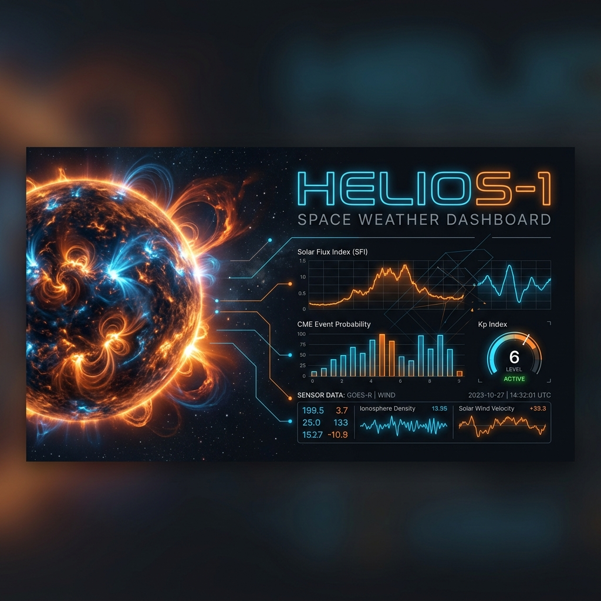
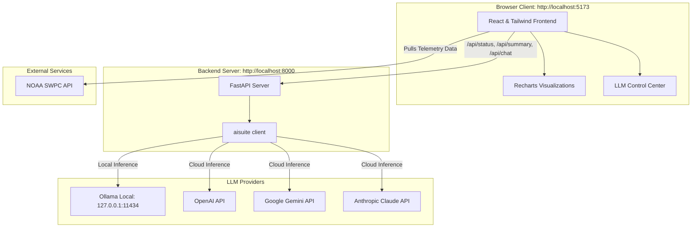

# HELIOS-1 Space Weather Dashboard & AI Analyst


HELIOS-1 is a real-time Space Weather Intelligence Console and AI Analyst dashboard. Built with a dark, high-contrast "NASA Mission Control" aesthetic, it consumes direct real-time telemetry from the NOAA Space Weather Prediction Center (SWPC) and uses Andrew Ng's `aisuite` to run a local or cloud-based LLM analyst directly in your command center.



---

## 🌟 Key Features

*   **Real-Time Space Telemetry**: Fetches 7 critical solar and geomagnetic data points directly from NOAA SWPC APIs every 60 seconds (no authentication required).
*   **Context-Aware Status Badges**: Automatically classifies solar metrics into standardized levels, showing active warning indicators if thresholds are breached.
*   **Custom Kp Gauge**: An interactive, glowing vector SVG gauge indicating the current Planetary K-Index with segmented storm categorization.
*   **3-Day Geomagnetic Forecast**: Displays a timeline forecast for geomagnetic storm activity (Kp Index) over the next 72 hours.
*   **Detail Modals & Recharts**: Clicking any metric card reveals a detailed, interactive modal displaying history trendlines, data tables, and customized NOAA G/S/R threshold scales.
*   **Integrated AI Space Analyst**: Uses `aisuite` to generate a concise, 3-sentence space weather briefing in a professional "NASA Mission Control" tone.
*   **Interactive Analyst Chat**: Operators can converse with the AI space analyst, asking follow-up questions about current solar events. The system feeds full current telemetry as system context.
*   **LLM Control Center**: In-dashboard LLM provider and model selector. Toggle dynamically between local Ollama models and cloud APIs (Google Gemini, OpenAI, Anthropic).
*   **Secure BYOK (Bring Your Own Key)**: Custom API keys are input on the frontend and transmitted over secure, temporary headers (`X-Gemini-Key`, `X-OpenAI-Key`, `X-Anthropic-Key`), keeping your keys out of persistent backend storage.

---

## 📐 System Architecture

The frontend is built on **React 19** and **Vite 8**, using **Tailwind CSS v4** for styles and **Recharts** for time-series visualization. The backend is a lightweight **FastAPI** server that acts as a secure model proxy using **aisuite**.



---

## ⚡ Getting Started

### Prerequisites

Ensure you have the following installed on your system:
*   **Node.js** >= 18.x
*   **Python** >= 3.10.x
*   **Ollama** (Optional, for running local models like `gemma4:e4b` or `llama3`)

---

### Installation & Setup

1.  **Clone the Repository**
    ```bash
    git clone https://github.com/your-username/helios-1.git
    cd helios-1
    ```

2.  **Install Frontend Dependencies**
    ```bash
    npm install
    ```

3.  **Install Backend Python Dependencies**
    We recommend using a Python virtual environment:
    ```bash
    python3 -m venv venv
    source venv/bin/activate  # On Windows: venv\Scripts\activate
    pip install -r requirements.txt
    ```

4.  **Configure Environment Variables**
    Copy the example environment file:
    ```bash
    cp .env.example .env
    ```
    Open `.env` in your text editor and adjust values. If you're using Ollama, the defaults are ready to go:
    ```env
    LLM_PROVIDER=ollama
    LLM_MODEL=gemma4:e4b
    OPENAI_API_KEY=ollama
    GEMINI_API_KEY=your_gemini_key
    ANTHROPIC_API_KEY=not-set
    ```

---

### Running the Application

HELIOS-1 uses `concurrently` to launch both the FastAPI backend and the Vite dev server with a single command:

```bash
npm run dev
```

*   **Vite Dev Server (Frontend)**: Running at [http://localhost:5173](http://localhost:5173)
*   **FastAPI Server (Backend)**: Running at [http://localhost:8000](http://localhost:8000)

*Note: Vite is configured to proxy all `/api/*` requests to the FastAPI backend automatically.*

---

## 🧠 LLM Provider Configuration

HELIOS-1 uses Andrew Ng's unified `aisuite` package, making it simple to switch models.

### Option A: Local Ollama (Recommended)
1.  Download and install [Ollama](https://ollama.com/).
2.  Start the Ollama application or run `ollama serve`.
3.  Pull the default model (or any model of your choice):
    ```bash
    ollama pull gemma4:e4b
    ```
4.  Configure `.env` to use `LLM_PROVIDER=ollama` and `LLM_MODEL=gemma4:e4b`.

### Option B: Cloud API Keys (Gemini, OpenAI, Anthropic)
You can configure global API keys in your `.env` file, or input them dynamically in the frontend **LLM Control Center** dropdown. 
*   **OpenAI**: Set `OPENAI_API_KEY` in `.env` or input in dashboard.
*   **Google Gemini**: Set `GEMINI_API_KEY` in `.env` or input in dashboard.
*   **Anthropic**: Set `ANTHROPIC_API_KEY` in `.env` or input in dashboard.

---

## 📡 Telemetry Data Specifications

HELIOS-1 connects directly to the following NOAA SWPC feeds:

| Metric | Source Endpoint | Description | Healthy Baseline | Warning / Alert Trigger |
| :--- | :--- | :--- | :--- | :--- |
| **Planetary K-Index (Kp)** | `/products/noaa-scales.json` | Geomagnetic activity indicator. | `Kp 0 - 3` (Quiet) | `Kp >= 4` (Active) / `Kp >= 5` (Storm) |
| **Solar Wind Speed** | `/products/summary/solar-wind-plasma.json` | Velocity of solar wind in km/s. | `< 450 km/s` | `>= 500 km/s` (Coronal hole/CME impact) |
| **Proton Density** | `/products/summary/solar-wind-plasma.json` | Solar particles per cubic centimeter ($p/cm^3$). | `< 10 p/cm³` | `>= 15 p/cm³` |
| **IMF Bt** | `/products/summary/solar-wind-mag.json` | Interplanetary Magnetic Field strength in nT. | `< 5.0 nT` | `>= 10.0 nT` |
| **IMF Bz** | `/products/summary/solar-wind-mag.json` | North/South orientation of magnetic field in nT. | `> 0.0 nT` (Northward) | `< -3.0 nT` (Southward; couples with Earth) |
| **X-Ray Flux** | `/products/summary/xray-flux-1-day.json` | GOES satellite solar radiation energy ($W/m^2$). | `< 1e-6 W/m²` (A/B Class) | `>= 1e-5 W/m²` (M-Class flare / R1 blackout) |
| **Proton Flux** | `/products/summary/proton-flux-1-day.json` | High-energy solar protons ($pfu$). | `< 1.0 pfu` | `>= 10.0 pfu` (S1 Solar Radiation Storm) |
| **F10.7 Radio Flux** | `/products/summary/10cm-flux.json` | Solar radio emissions at 10.7cm wavelength ($sfu$). | `< 100 sfu` | `>= 150 sfu` (High solar activity) |

---

## 🔌 API Endpoints

The FastAPI backend exposes three main endpoints:

### 1. `GET /api/status`
Checks the local Ollama daemon connection, lists pulled models, and returns API key availability status.
*   **Response Payload**:
    ```json
    {
      "status": "ONLINE",
      "ollama": {
        "status": "ONLINE",
        "host": "127.0.0.1:11434",
        "available_models": ["gemma4:e4b", "llama3:latest"]
      },
      "config": {
        "default_provider": "ollama",
        "default_model": "gemma4:e4b"
      },
      "providers_keys": {
        "gemini": "CONFIGURED",
        "openai": "MISSING",
        "anthropic": "MISSING"
      }
    }
    ```

### 2. `POST /api/summary`
Generates a concise, 3-sentence space weather briefing based on the telemetry payload.
*   **Request Payload**:
    ```json
    {
      "telemetry": {
        "kp": 3.6,
        "windSpeed": 420.5,
        "bz": -2.1,
        "protonDensity": 6.2,
        "f107": 142.0
      },
      "provider": "ollama",
      "model": "gemma4:e4b"
    }
    ```
*   **Response Payload**:
    ```json
    {
      "summary": "Current geomagnetic conditions are quiet with Kp at 3.6 and solar wind speed steady at 420 km/s. The IMF Bz is slightly southward but stable. No active alerts are in place.",
      "model_used": "ollama:gemma4:e4b"
    }
    ```

### 3. `POST /api/chat`
Handles interactive chat turns between the operator and the space analyst, utilizing conversation history.
*   **Request Payload**:
    ```json
    {
      "telemetry": { ... },
      "messages": [
        {"role": "user", "content": "What does a southward Bz mean?"}
      ],
      "provider": "ollama",
      "model": "gemma4:e4b"
    }
    ```
*   **Response Payload**:
    ```json
    {
      "message": "A southward Bz orientation (negative values) means the interplanetary magnetic field is pointing south, aligning opposite to Earth's magnetic shield. This allows solar wind energy to couple more easily with Earth's magnetosphere, potentially triggering geomagnetic storms.",
      "model_used": "ollama:gemma4:e4b"
    }
    ```

---

## 🛠️ Verification & Quality Assurance

HELIOS-1 has undergone a rigorous QA process covering:
1.  **Strict Error Boundaries**: Full app container protection with interactive fallback UIs to handle network or NOAA endpoint timeouts gracefully.
2.  **Dynamic Key Sanitization**: Prevents global environment state mutation, allowing multiple users to run independent cloud models concurrently with distinct API keys.
3.  **Strict Baseline Thresholds**: Validated status algorithms ensuring telemetry data falls precisely into standard NOAA Space Weather Scales.
4.  **Lint-Free Codebase**: 0 compilation warnings and absolute ESLint compliance.

---

## 📄 License

This project is licensed under the MIT License. See [LICENSE](LICENSE) for details.

## 🤝 Acknowledgments

*   Data provided by the [NOAA Space Weather Prediction Center](https://www.swpc.noaa.gov/).
*   Powered by Andrew Ng's [`aisuite`](https://github.com/andrewyng/aisuite) for multi-provider LLM support.
